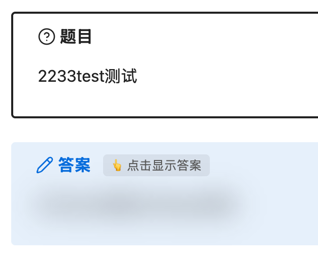

<div align="center">

# 📓 Mistake Notebook (错题本)

**把错题变成可复习的资产：遮住答案，先自己想。**

答案遮罩 · 点击揭晓 · 长答案自动拆分 · 就地插入 · 极简模式

[](https://github.com/Adobiz/obsidian-mistake-notebook/releases)
[](https://github.com/Adobiz/obsidian-mistake-notebook/actions)
[](LICENSE)


</div>

---

## ✨ 特性

- 🎭 **答案遮罩，四种风格** — 模糊 / 纯白 / 马赛克 / 纯黑，复习时答案默认遮住，逼你先自己想；点击整块揭晓，标题栏可一键「重新遮住」。
- ✂️ **长答案自动拆分** — 答案超过阈值（默认 400 字，可配）或含展示公式时，自动拆到独立答案页，题目页只留一个跳转链接，读完可一键返回。
- 📥 **就地插入错题** — 在任意笔记的光标处直接插入一道错题（题目 + 答案块），不新建笔记；知识点归纳和错题同页共存。
- 🟥 **题目强调框** — 题目自动包进黑色描边强调块，与答案块视觉呼应；也可选中文字右键手动强调 / 取消。
- 🧘 **极简模式** — 一键隐藏属性面板、反链等杂项；录入只填题目与答案，学科等自动记为未分类。
- 🖼 **截图直接粘贴** — 答案框里 ⌘V 粘贴图片，自动按你在 Obsidian 里配置的附件目录落盘并插入引用。
- 📂 **数据不锁定** — 一道错题就是一个普通 Markdown 笔记 + frontmatter，随时可手改、可被其他插件与脚本处理，迁移零成本。

<!-- 截图：把图片放进 docs/screenshots/ 后取消注释
<p align="center">
  
  
</p>
-->

## 🚀 安装

**社区插件市场**（审核通过后）：设置 → 第三方插件 → 浏览 → 搜索「**错题本**」或 "Mistake Notebook"。

**手动安装**：从 [Releases](https://github.com/Adobiz/obsidian-mistake-notebook/releases) 下载 `main.js`、`manifest.json`、`styles.css`，放入

```
<你的库>/.obsidian/plugins/mistake-notebook/
```

然后开启第三方插件中的 Mistake Notebook。也可以用 [BRAT](https://github.com/TfTHacker/obsidian42-brat) 安装测试版。

## 📖 使用

### 命令

| 命令                                 | 说明                                 |
| ------------------------------------ | ------------------------------------ |
| **新建错题（含答案遮罩）**           | 打开录入弹窗，创建独立错题笔记       |
| **在当前位置插入错题（含答案遮罩）** | 在当前笔记光标处插入错题，不新建笔记 |
| **把当前笔记的内联答案拆分为答案页** | 对已有笔记就地拆分长答案             |
| **切换极简模式**                     | 开关极简模式（界面减法 + 简化录入）  |

编辑视图内右键还有快捷入口：**插入错题**（在当前位置插入 / 新建错题页面）与**题目显示强调**（选中文字后强调 / 取消，toggle）。

### 录入

弹窗支持 Markdown 与 LaTeX；答案框里直接 ⌘V 粘贴截图，图片自动按 Obsidian 附件目录设置落盘。答案长度实时统计，**建议拆分**时自动勾选拆分复选框（可改）。

### 设置

| 设置                         | 默认 | 说明                                                          |
| ---------------------------- | ---- | ------------------------------------------------------------- |
| 默认遮罩风格                 | 模糊 | 未单独指定的答案块使用；单题可用 frontmatter `maskStyle` 覆盖 |
| 长答案字符阈值               | 400  | 超过则建议拆分独立答案页                                      |
| 含展示型公式触发拆分         | 开   | 答案含 `$$…$$` 时按长答案处理                                 |
| 含图片触发拆分               | 关   | 照片答案默认原地遮罩揭晓                                      |
| 新建错题时的拆分行为         | 询问 | 弹窗内预选拆分复选框让你确认                                  |
| 答案页跟随错题目录           | 关   | 开启后答案页生成在错题笔记所在目录内                          |
| └ 在错题目录内创建答案文件夹 | 关   | 答案页统一放 `错题目录/答案/` 子文件夹                        |
| 隐藏错题笔记的属性区         | 开   | 错题/答案页不显示顶部属性面板（数据仍完整写入）               |
| 极简模式                     | 关   | 界面只留内容；录入只填题目与答案                              |

## 📂 数据结构

一道错题 = 一个 Markdown 笔记：

```markdown
---
id: "mt-20250212-数学-a1b2c3"
subject: "数学"
answerMode: "page" # inline=同页；page=已拆到答案页
maskStyle: "auto" # auto/blur/white/mosaic/black
status: "pending" # pending/reviewing/mastered/archived
---

# 函数单调性

> [!mt-question] 题目
> 题干……

> [!answer] 查看完整答案（答案较长，已拆分答案页）
> [[函数单调性-数学-20250212-080509-答案|查看完整答案 →]]
```

答案页带 `mt-answer-of` 反链与「← 返回题目」链接。所有约定见 [docs/ADR](docs/ADR-INDEX.md)。

## 🛠 开发

```bash
npm install
npm run dev        # watch 构建，产物 main.js（拷入 vault 的插件目录即可调试）
npm run verify     # typecheck → lint → prettier → vitest → build，合并前必须全绿
npm run test:watch # 单测热重载
```

分层约束：领域层 `src/domain` 纯 TypeScript、零依赖（不 import "obsidian"），可在 Node 直接单测；Obsidian API 只出现在适配层与 UI 层。业务规则（拆分阈值、命名、去重）一律进 `src/domain` 并配 `*.test.ts`。样式通过 esbuild 的 css-as-text 打包进 `main.js` 运行时注入，`styles.css` 保留为等价兜底。

## 🗺 Roadmap

- [x] M1：录入（文字/截图）+ 答案遮罩 + 点击揭晓 + 长答案自动拆分
- [x] M1.5：就地插入、题目强调框、极简模式、属性隐藏
- [ ] M2：复习视图（遮题自测：记住了 / 又错了）+ 间隔重复调度
- [ ] M3：学科默认遮罩风格、统计仪表盘

## 🤝 贡献

Issue 与 PR 都欢迎；提交前请跑 `npm run verify`。提交信息遵循 Conventional Commits。

## License

[MIT](LICENSE) © Adobiz
